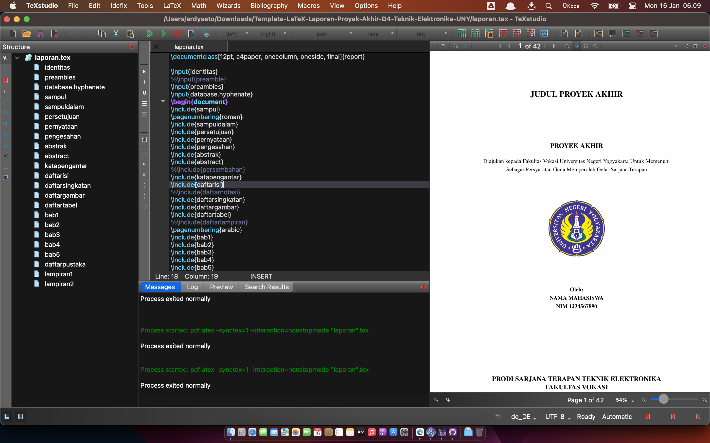
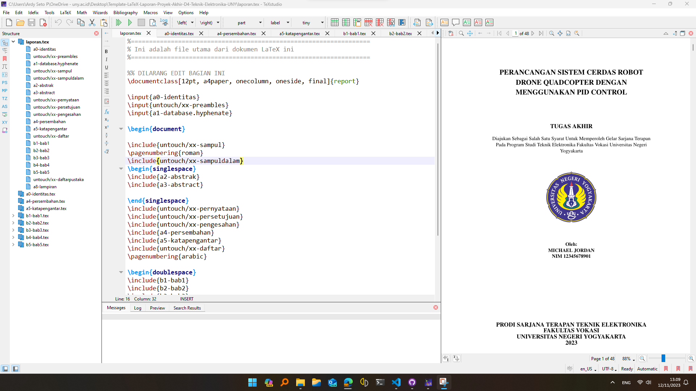

# 📘 Tugas Akhir

_Program Sarjana Teknik Teknologi Informasi – Universitas Negeri Yogyakarta_

Dokumen LaTeX ini berisi proposal dan laporan Tugas Akhir Skripsi mahasiswa S1 Teknologi Informasi UNY.

---

## 📁 Struktur Proyek

```
Template-LaTeX-Laporan-Tugas-Akhir
├── contents                        # Folder untuk menyimpan konten utama skripsi
│   ├── a0-identitas.tex            # Isi identitas laporan
│   ├── a1-hyphenate.tex            # Database untuk hyphenation
│   ├── a2-abstrak.tex              # Abstrak dalam Bahasa Indonesia
│   ├── a3-abstract.tex             # Abstrak dalam Bahasa Inggris
│   ├── a4-persembahan.tex          # Persembahan
│   ├── a5-katapengantar.tex        # Kata Pengantar
│   ├── a6-daftarsingkatan.tex      # Daftar Singkatan
│   ├── a7-pustaka.bib              # Daftar pustaka dalam format BibTeX
│   ├── a8-lampiran.tex             # Lampiran
│   ├── b1-bab1.tex                 # BAB I - Pendahuluan
│   ├── b2-bab2.tex                 # BAB II - Tinjauan Pustaka
│   ├── b3-bab3.tex                 # BAB III - Metode Penelitian
│   ├── b4-bab4.tex                 # BAB IV - Hasil dan Pembahasan
│   ├── b5-bab5.tex                 # BAB V - Kesimpulan dan Saran
│   ├── b6-bab6.tex                 # BAB VI - Tutorial LaTeX (opsional)
│   ├── images                      # Folder untuk menyimpan gambar
│   ├── gambar-kucing.jpg
│   ├── logo-uny.png
│   ├── screenshot-miktex.png
│   ├── screenshot-overleaf.png
│   ├── screenshot-texstudio-macos.png
│   └── screenshot-texstudio-windows.png
├── templates                       # Folder untuk menyimpan file yang tidak perlu diubah
│   ├── xx-daftar.tex
│   ├── xx-daftarpustaka.tex
│   ├── xx-pengesahan.tex
│   ├── xx-pernyataan.tex
│   ├── xx-persetujuan-proposal.tex
│   ├── xx-persetujuan-ujian.tex
│   ├── xx-preambles.tex
│   ├── xx-sampul-laporan.tex
│   ├── xx-sampul-proposal.tex
│   ├── xx-sampuldalam-laporan.tex
│   └── xx-sampuldalam-proposal.tex
├── code                            # Folder untuk menyimpan kode program
│   ├── code_sample.cpp
│   ├── code_sample.ino
│   ├── code_sample.java
│   └── code_sample.py
├── CHANGELOG               # Catatan perubahan
├── LICENSE                 # Lisensi proyek
├── skripsi.pdf             # Hasil kompilasi skripsi
├── skripsi.tex             # File utama untuk kompilasi skripsi
└── README.md
```

---

## 🧩 Fitur Utama

✅ **Format sesuai standar** Prodi S1 Teknologi Informasi UNY

✅ **Dual mode support**: Kompilasi proposal & skripsi akhir

✅ **Kompilasi otomatis** dengan script `compile.sh` yang canggih

✅ **Dependency caching** untuk kompilasi ~65% lebih cepat

✅ **Tutorial lengkap**: Gambar, kode program, persamaan, tabel, dan TikZ diagrams

✅ **Referensi otomatis** dengan BibTeX dan cross-referencing

✅ **Multi-platform**: Compatible dengan TeXstudio, VS Code, dan Overleaf

✅ **Auto package management**: Instalasi package LaTeX otomatis

---

## 🚀 Compilation Script (`compile.sh`)

Template ini dilengkapi dengan script kompilasi canggih yang mempermudah proses build dokumen LaTeX dengan fitur dependency management dan caching system.

### ✨ **Fitur Script Compile**

#### 🎯 **Smart Dependency Management**

- **Auto-detection**: Deteksi otomatis LaTeX installation dan package requirements
- **Auto-installation**: Install missing packages secara otomatis via `tlmgr`
- **Cross-platform**: Support macOS, Windows, dan Linux
- **Fallback instructions**: Panduan manual jika auto-install gagal

#### ⚡ **Performance Optimization**

- **Dependency Caching**: Cache status dependencies untuk 7 hari
- **Speed Improvement**: ~65% lebih cepat pada subsequent runs
- **Smart Cache**: Auto-invalidation jika LaTeX version berubah
- **Background Processing**: Multiple verbosity levels untuk berbagai use cases

#### 🛠️ **Advanced Options**

- **Multiple Build Passes**: 4-pass compilation untuk resolving semua references
- **BibTeX Integration**: Automatic bibliography processing
- **Cleanup**: Auto-cleanup temporary files
- **Error Handling**: Comprehensive error reporting dan troubleshooting

### 📋 **Quick Start**

```bash
# Masuk ke direktori cd

# Kompilasi normal (menggunakan cache jika tersedia)
./compile.sh

# Kompilasi silent (untuk automation)
./compile.sh --quiet

# Lihat semua opsi yang tersedia
./compile.sh --help
```

### 🎛️ **Command Line Options**

| Option               | Deskripsi                              |
| -------------------- | -------------------------------------- |
| `--help`             | Tampilkan bantuan lengkap              |
| `--quiet`            | Mode silent (hanya hasil akhir)        |
| `--verbose`          | Mode verbose (output lengkap)          |
| `--debug`            | Mode debug (maximum verbosity)         |
| `--error-only`       | Hanya tampilkan errors                 |
| `--warning`          | Tampilkan warnings dan errors          |
| `--final-warnings`   | Hanya warnings dari kompilasi terakhir |
| `--clean`            | Bersihkan temporary files              |
| `--skip-deps`        | Skip dependency checking               |
| `--force-deps-check` | Force full dependency recheck          |
| `--clear-cache`      | Clear dependency cache                 |

### 📊 **Performance Comparison**

| Run Type                            | Waktu | Improvement    |
| ----------------------------------- | ----- | -------------- |
| First run (dengan dependency check) | ~12s  | Baseline       |
| Cached run (menggunakan cache)      | ~4s   | **65% faster** |
| Skip dependencies                   | ~4s   | **68% faster** |

### 🔧 **Usage Examples**

```bash
# Development workflow (daily use)
./compile.sh                        # Fast compilation dengan cache

# CI/CD pipeline
./compile.sh --quiet --skip-deps     # Maximum speed untuk automation

# Troubleshooting
./compile.sh --debug                 # Full diagnostic output
./compile.sh --force-deps-check      # Refresh dependency cache

# Maintenance
./compile.sh --clear-cache           # Reset cache system
./compile.sh --clean                 # Clean temporary files only
```

### 🗂️ **Cache System**

Script menggunakan intelligent caching system yang disimpan di `.latex_deps_cache/`:

```
.latex_deps_cache/
├── dependency_status.log    # Status package dependencies
└── versions.log            # LaTeX version tracking
```

- **Cache Validity**: 7 hari (168 jam)
- **Auto-Invalidation**: Jika LaTeX version berubah
- **Size**: ~500 bytes total
- **Git Integration**: Otomatis ditambahkan ke `.gitignore`

### 🎨 **TikZ & Advanced Features**

Template ini dilengkapi dengan dukungan lengkap untuk pembuatan diagram dan visualisasi profesional:

#### 📊 **TikZ Diagrams (BAB VI)**

- **Flowchart**: Diagram alur kerja sistem yang kompleks
- **Mathematical Plots**: Grafik fungsi matematika dengan `pgfplots`
- **Block Diagrams**: Sistem kontrol feedback dan arsitektur sistem
- **Network Topology**: Diagram jaringan komputer dan komunikasi
- **Pie Charts**: Visualisasi data distribusi dengan `pgf-pie`

#### 🔧 **TikZ Libraries Included**

```latex
% Pre-configured libraries
\usepackage{tikz}
\usetikzlibrary{calc, shapes, arrows.meta, positioning}
\usepackage{pgfplots}
\usepackage{pgf-pie}
```

#### 🎯 **Table Examples**

- **Simple Tables**: Data hasil pengujian dan measurement
- **Advanced Tables**: Multi-row/column dengan `multirow` dan `multicolumn`
- **Professional Formatting**: Booktabs untuk publikasi-ready tables

### 🚨 **Troubleshooting**

#### Missing LaTeX Installation

```bash
# macOS
brew install --cask mactex

# Ubuntu/Debian
sudo apt-get install texlive-full

# Windows
# Download dan install MiKTeX dari https://miktex.org/
```

#### Package Installation Issues

```bash
# Manual package installation
tlmgr install package_name

# Update package manager
tlmgr update --self
tlmgr update --all

# Permission issues (Linux/macOS)
sudo tlmgr install package_name
```

#### Performance Issues

```bash
# Clear cache dan rebuild
./compile.sh --clear-cache
./compile.sh --force-deps-check

# Skip dependencies untuk speed
./compile.sh --skip-deps --quiet
```

---

## 🖥️ Panduan Instalasi & Penggunaan

### 💻 **Windows (TeXstudio)**

1. **Install MikTeX**: [https://miktex.org/download](https://miktex.org/download)

   > Pilih _For All Users_, centang opsi _Always install missing packages_

2. **Install TeXstudio**: [https://www.texstudio.org/](https://www.texstudio.org/)

3. **Update MikTeX** melalui MikTeX Console

4. **Clone/unduh** repositori dan buka `skripsi.tex` melalui TeXstudio

5. **Compile**: Klik **Build & View** untuk melihat hasil (`skripsi.pdf`)

### 🍎 **macOS (VS Code)**

1. **Install MacTeX**:

   ```bash
   brew install --cask mactex
   ```

   Atau download dari [https://www.tug.org/mactex/](https://www.tug.org/mactex/)

2. **Install VS Code LaTeX Workshop extension**

3. **Clone repositori dan buka di VS Code**

4. **Compile**: Gunakan script atau Ctrl+Alt+B

   ```bash
   cd
   ./compile.sh
   ```

> 📖 **Tutorial lengkap**: [LaTeX di MacOS dengan VS Code](https://sudorealm.com/blog/how-to-write-latex-documents-with-visual-studio-code-on-mac)

### 🐧 **Linux (Ubuntu/Debian)**

1. **Install TeX Live**:

   ```bash
   sudo apt-get update
   sudo apt-get install texlive-full
   ```

2. **Install editor** (pilih salah satu):

   ```bash
   # TeXstudio
   sudo apt-get install texstudio

   # VS Code
   sudo snap install code --classic
   ```

3. **Clone dan compile**:

   ```bash
   git clone [repository-url]
   cd Template-LaTeX-Tugas-Akhir-Sarjana-Terapan-UNY/
   ./compile.sh
   ```

### 🌐 **Overleaf (Online)**

1. \*_Upload _ ke Overleaf
2. **Set main document** ke `laporan.tex`
3. **Compile** langsung di browser

> ⚠️ **Note**: Script `compile.sh` tidak tersedia di Overleaf

---

## ⚙️ Pengaturan Proposal / Laporan

Gunakan perintah berikut pada baris awal `laporan.tex`:

```latex
%\newcommand{\doctype}{Proposal}   % Gunakan untuk Proposal
\newcommand{\doctype}{Laporan}     % Gunakan untuk Laporan
```

> _Hanya aktifkan salah satu perintah (`%` artinya dikomentari)_

---

## ✍️ Langkah Pengerjaan Laporan

| File                          | Keterangan                                         |
| ----------------------------- | -------------------------------------------------- |
| `a0-identitas.tex`            | Isi nama, NIM, judul TA, pembimbing, dll           |
| `b1-bab1.tex` – `b5-bab5.tex` | Isi konten utama BAB I–V                           |
| `a7-pustaka.bib`              | Tambah referensi dengan BibTeX                     |
| `a8-lampiran.tex`             | Tambah daftar lampiran                             |
| `b6-bab6.tex`                 | _Berisi tutorial LaTeX, opsional, dapat diabaikan_ |
| `a2–a6-*.tex`                 | Abstrak, Kata Pengantar, Persembahan, dll.         |

---

## 📚 Manajemen Referensi

Gunakan salah satu reference manager berikut:

- [Mendeley](https://www.mendeley.com/)
- [Zotero](https://www.zotero.org/)
- [JabRef](https://www.jabref.org/) _(direkomendasikan)_

Format ekspor: `.bib` (BibTeX), lalu tambahkan ke file `a7-pustaka.bib`.

---

## 🎬 Video Tutorial

| No  | Judul                                              | Link                                                   |
| --- | -------------------------------------------------- | ------------------------------------------------------ |
| 1   | Penggunaan Template TA UNY                         | [YouTube](https://www.youtube.com/watch?v=lnPTVrOGB90) |
| 2   | Penulisan Isi Laporan                              | [YouTube](https://www.youtube.com/watch?v=4Qk_2pknhsM) |
| 3   | Menambah Gambar dan Tabel                          | [YouTube](https://www.youtube.com/watch?v=oxY1mbZgv94) |
| 4   | Referensi dan Sitasi                               | [YouTube](https://www.youtube.com/watch?v=goq-IS4WJW4) |
| 5   | Menulis Kode Program                               | [YouTube](https://www.youtube.com/watch?v=JeSJ0mYfxA0) |
| 6   | Workshop Lengkap Proposal dan Laporan dengan LaTeX | [YouTube](https://www.youtube.com/watch?v=anMLRydjDOE) |

---

## 📝 Changelog

Catatan lengkap perubahan dan versi terbaru tersedia di file:
📄 [CHANGELOG](CHANGELOG)

---

## 🖼️ Screenshot

| MacOS                                                     | Windows                                                       |
| --------------------------------------------------------- | ------------------------------------------------------------- |
|  |  |

---

## 📄 Lisensi

Proyek ini dilisensikan di bawah [MIT License](LICENSE).

---

## 🤝 Kontribusi

Saran, kontribusi, dan perbaikan sangat terbuka.
Silakan buat **Pull Request** atau buka **Issue** melalui GitHub.

---

## 📬 Kontak

Jika Anda memiliki pertanyaan, hubungi:
📧 [ardyseto@uny.ac.id](mailto:ardyseto@uny.ac.id)
👤 [@2black0](https://github.com/2black0)

---
